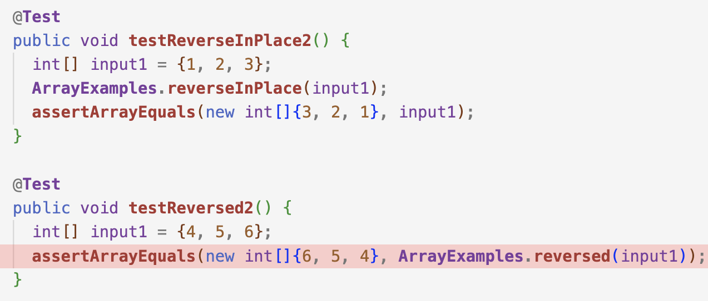

# Lab Report 2 - Servers and Bugs
## Part1: String Server
1. My code for StringServer:
```
class Handler implements URLHandler {
    // The one bit of state on the server: a number that will be manipulated by
    // various requests.
    ArrayList<String> str = new ArrayList<>();

    public String handleRequest(URI url) {

        if (url.getPath().equals("/")) {
            String output = "";
            if(str == null){
                return "There is no current string";
            }
            \\adding new line
            for(String curString: str){
                output = output + curString + "\n";
            }
            return "current string is "+ output;
            
        } 
        else if (url.getPath().contains("/add")) {
            String output = "";
            String[] parameters = url.getQuery().split("=");
            if (parameters[0].equals("s")) {
                str.add(parameters[1]);
                //adding new line
                for(String curString: str){
                    output = output + curString + "\n";
                }
                return output;
            
            } 
        }
        return "404 Not Found!";
    }
}
```
2. The output for `/add-message?s=Hello` :

The method `handleRequest(URI url)` is being called in this case, more specifically, it is using the else statement because the URL contains "/add". We get the query using getQuery() and split from "=" to store the string infront of "=" and after "=" into a string array. To produce a styled output, I made a string variable output, adding each parameters and adding a new line after it.
3. The output for `/add-message?s=How are you` :

This build apon the previous ouput, this also uses the else statement since the URL contains "/add", using `getQuery()` and `split("=")` to store the string infront of "=" and after "=" into a string array. Assign all the values into output variable using an enhanced for loop, adding a new line after each parameter.
## Part2
Testing `ReverseInPlace()` and `Reverse()`

JUnit gives me the following result (Symptoms):
```
testReverseInPlace2(): arrays first differed at element [2]; expected:[1] but was:[3]
testReversed2(): arrays first differed at element [0]; expected:[6] but was:[0]
```
## Part3
