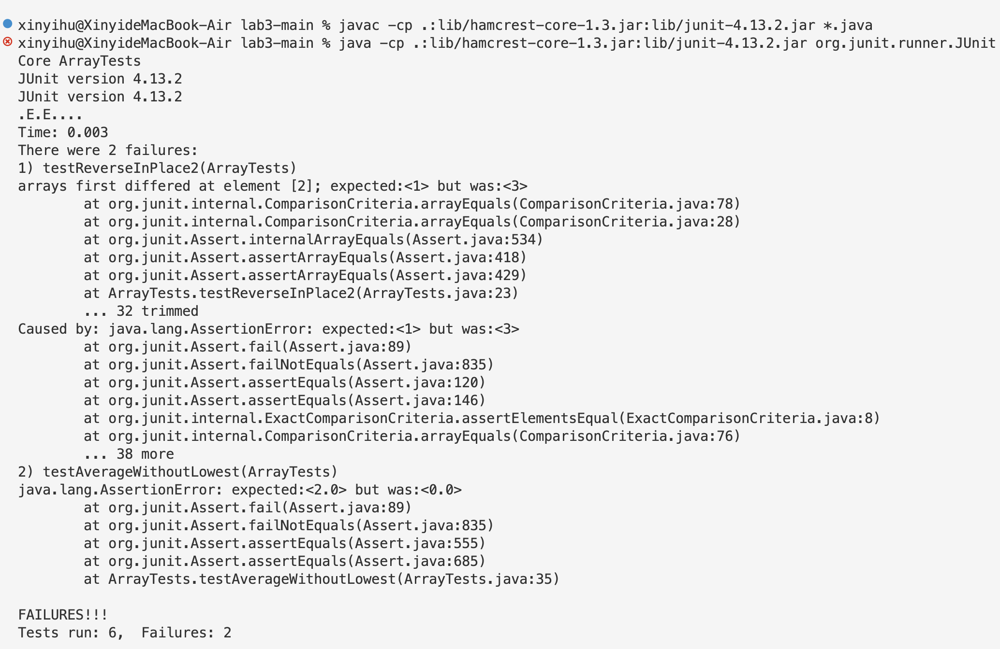

# Lab Report 2 - Servers and Bugs
## Part1: String Server
1. My code for StringServer:
``````java
class Handler implements URLHandler {
    // The one bit of state on the server: a number that will be manipulated by
    // various requests.
    ArrayList<String> str = new ArrayList<>();

    public String handleRequest(URI url) {

        if (url.getPath().equals("/")) {
            String output = "";
            if(str == null){
                return "There is no current string";
            }
            \\adding new line
            for(String curString: str){
                output = output + curString + "\n";
            }
            return "current string is "+ output;
            
        } 
        else if (url.getPath().contains("/add")) {
            String output = "";
            String[] parameters = url.getQuery().split("=");
            if (parameters[0].equals("s")) {
                str.add(parameters[1]);
                //adding new line
                for(String curString: str){
                    output = output + curString + "\n";
                }
                return output;
            
            } 
        }
        return "404 Not Found!";
    }
}
``````
2. The output for `/add-message?s=Hello` :

The method `handleRequest(URI url)` is being called in this case, more specifically, it is using the else statement because the URL contains "/add". We get the query using getQuery() and split from "=" to store the string infront of "=" and after "=" into a string array, also adding it to the ArrayList. To produce a styled output, I made a string variable output, adding each parameters and adding a new line after it.
3. The output for `/add-message?s=How are you` :

This build apon the previous ouput, this also uses the else statement since the URL contains "/add", using `getQuery()` and `split("=")` to store the string infront of "=" and after "=" into a string array. Assign all the values int the ArrayList (in this case, contains "Hello", "How are you") into the output variable using an enhanced for loop, adding a new line after each parameter.
## Part2
1. Failure-inducing input: `ReverseInPlace2()`
``````java
  @Test
  public void testReverseInPlace2() {
    int[] input1 = {1, 2, 3};
    ArrayExamples.reverseInPlace(input1);
    assertArrayEquals(new int[]{3, 2, 1}, input1);
  }
``````
2. Input doesn't include failure: `Reverse2()`
``````java
  @Test
  public void testReversed2() {
    int[] input1 = {0, 0, 0};
    assertArrayEquals(new int[]{0, 0, 0}, ArrayExamples.reversed(input1));
  }
``````
3. Running JUnit:

4. Before-and-after code
**Before Code:**
``````java
  // Changes the input array to be in reversed order
  static void reverseInPlace(int[] arr) {
    for(int i = 0; i < arr.length; i += 1) {
      arr[i] = arr[arr.length - i - 1];
    }
  }
``````
When you assigned th value of `arr[arr.length - i - 1]` to `arr[i]`, the original value `arr[i]` are lost, therefore, in the lower half of the loof, the value assigned will be wrong.
**After Code:**
``````java
  // Changes the input array to be in reversed order
  static void reverseInPlace(int[] arr) {
    for(int i = 0; i < arr.length / 2; i += 1) {
      int temp = arr[i];
      arr[i] = arr[arr.length - i - 1];
      arr[arr.length - i - 1] = temp;
    }
  }
``````

## Part3
Firstly, making search engine is the one I found interesting and challenging. Starts from knowing the concepts of "port", "query", etc. to making and visiting the server, modified the values and parameters in the provided code, it is the first time that I know that we can make changes to a web by operating the url. Secondly, checking the symptoms of a JUnit test, I used JUnit test in cse12, so it is not a new thing, but I was able to identify the result and accociate with the concepts like "Symptom", "failure", "bug", etc. And by checking the JUit output to modify the code more precise.
