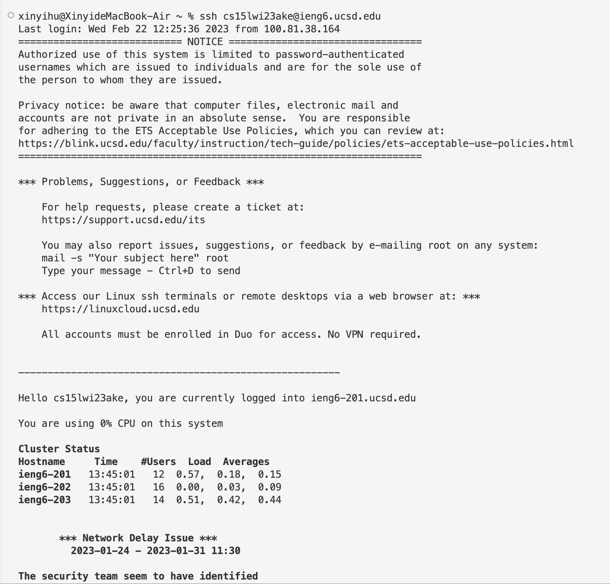
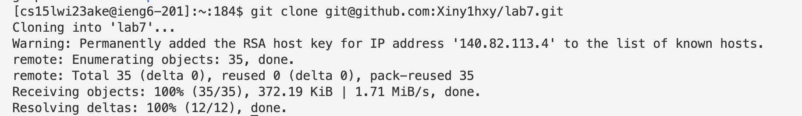
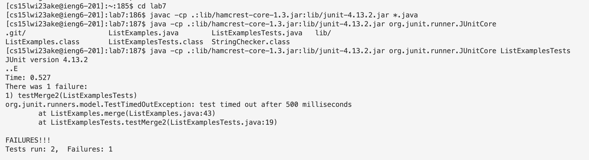
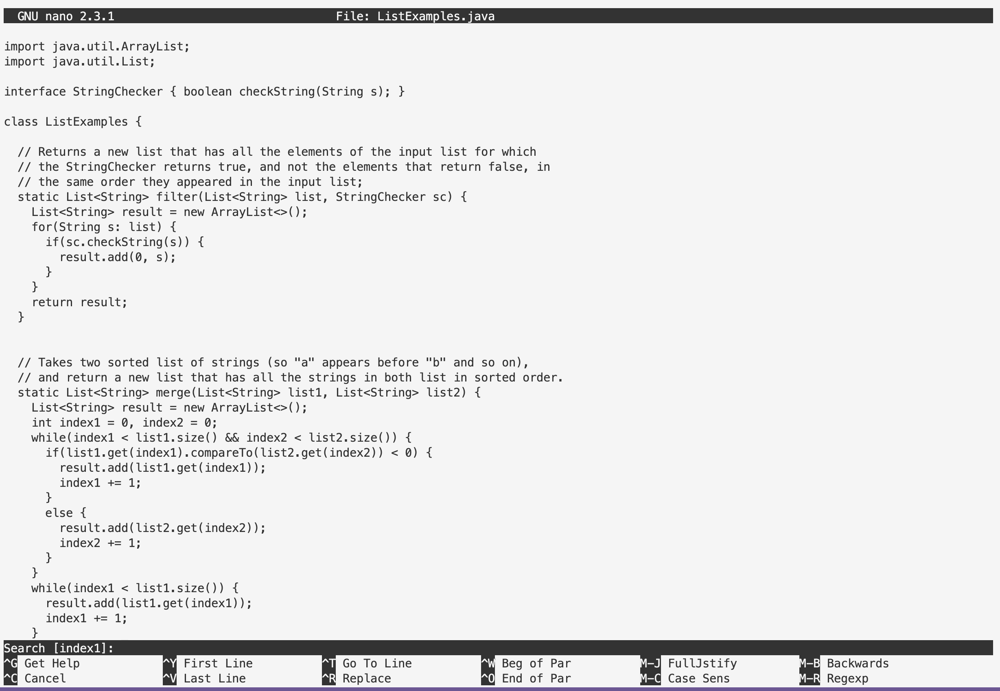
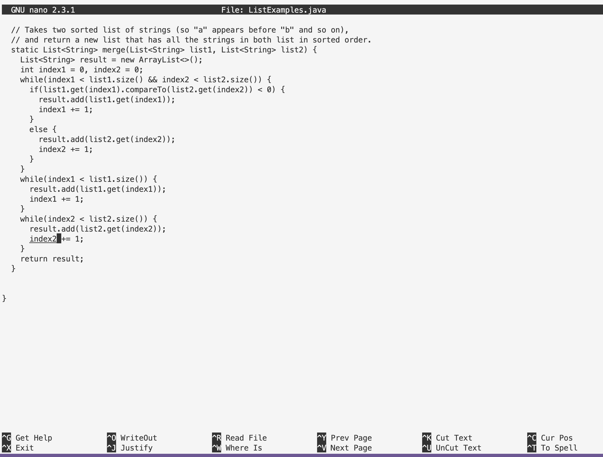
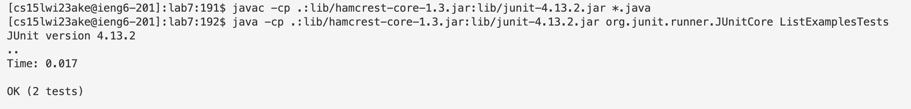
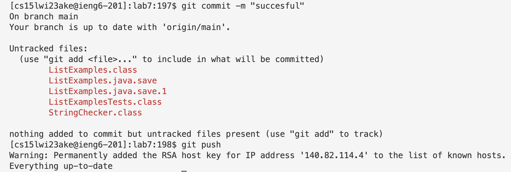

# Lab Report4: 
## 1. Setup
1. Delete any existing forks fo the repository you have on your account.
2. Fork the repository

## 3. The real deal
1. Start the timer!
2. Log into ieng6
Keys pressed: `ssh cs15lwi23xxx@ieng6.ucsd.edu`

**3. Clone your fork of the repository from your Github account**

Copy the SSH link of lab7.

Keys pressed: `git clone git@github.com:Xiny1hxy/lab7.git`

**4. Run the tests, demonstrating that they fail**

Enter `lab7` directory first in order to run the test.

1. Key pressed: `cd lab7`

2. Keys pressed: `javac -cp .:lib/hamcrest-core-1.3.jar:lib/junit-4.13.2.jar *.java`, `java -cp .:lib/hamcrest-core-1.3.jar:lib/junit-4.13.2.jar org.junit.runner.JUnitCore <tab>` to see the name of the test file, then type `ListExamplesTests`

**5. Edit the code file to fix the failing test**
1. Keys pressed: `nano L<tab>` + `.java` 
Press `<tab>` to autofill the `ListExample` and add `.java` manually.

2. Keys pressed: Use `<up>`/`<down>`/`<left>`/`<right>` to move the cursor to `index1` in the last while loop

* OR Keys pressed: `<Crtl> + W <enter>`,`index1`, then move the cursor.

* Change `index1` to `index2` (index1 in the last while loop!!!)
3. Key pressed: `<Crtl> + O`, `<Crtl> + X`, save the change and exit nano

**6. Run the tests, demonstrating that they now succeed**

Keys pressed: `<up><up><up><up><up><enter>`, `<up><up><up><up><up><enter>`

* The `javac -cp .:lib/hamcrest-core-1.3.jar:lib/junit-4.13.2.jar *.java` command was 5 up in the search history, so I used up arrow to access it. Then the `java -cp .:lib/hamcrest-core-1.3.jar:lib/junit-4.13.2.jar org.junit.runner.JUnitCore ListExamplesTests` command was also 5 up in the history, so I accessed and ran it in the same way.

**7. Commit and push the resulting change to your Github account**

1. Key pressed: `git commit -m "successful"`, `git push`

