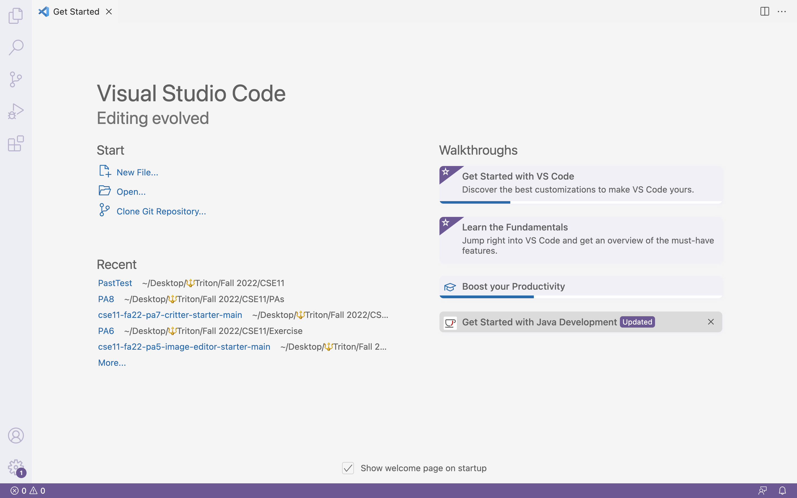
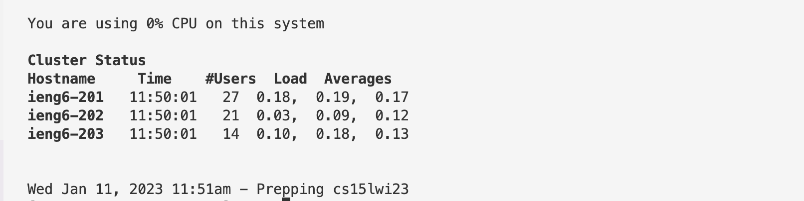

# Part1: Installing VScode
To install the Visual Studio Code, please visit the website [VScode](https://code.visualstudio.com/), and follow the instructions to download VScode to your computer. (For Mac users, remember to move VScode to your table)

When you successfully download VScode and open it, the homepage should look like this:

（It might not be exactly the same as mine, depand on your settings)

# Part2: Remotely Connecting
For CSE15L, your are prefered to use a course specific account that is connected to a remote computer in our institution to do work. Here are the insturctions that con help you to do the remote connection:

**1. Follow the "How to Reset your Password" tutorial in your group task document to get yout course-specific account and reset the password.**

**2. Open the terminal in VScode using (Ctrl/Command + `), or open it manually, clicking 'Terminal' in the top menw, and do 'new Ternimal'. Use the following command to connect the server:**
```
$ ssh cs15lwi23zz@ieng6.ucsd.edu
```
(Remember to replace `zz` with your own course-specific account. You don't need to type in `$`, we wrote `$` to help you the recognize that this is an command)
You will get a message like this: 
```
⤇ ssh cs15lwi23zz@ieng6.ucsd.edu
The authenticity of host 'ieng6.ucsd.edu (128.54.70.227)' can't be established.
RSA key fingerprint is SHA256:ksruYwhnYH+sySHnHAtLUHngrPEyZTDl/1x99wUQcec.
Are you sure you want to continue connecting (yes/no/[fingerprint])? 
```
*(This message should only occur when you are connecting to a new server for the first time)
Type `yes` to continue the connection to the server.)*

**3. Your terminal will request for the password, (the new passsword that you just reset for the course-specific account)**
```
⤇ ssh cs15lwi23zz@ieng6.ucsd.edu
The authenticity of host 'ieng6-202.ucsd.edu (128.54.70.227)' can't be established.
RSA key fingerprint is SHA256:ksruYwhnYH+sySHnHAtLUHngrPEyZTDl/1x99wUQcec.
Are you sure you want to continue connecting (yes/no/[fingerprint])? 
Password: 
```
*(This is a message from your client)*

**Enter the password and your terminal will show a message like this:**

*(This is a message from the remote server)*

You are now connected to a computerm in the CSE basement! We call your own computer the client, and the CSE computer the remote server, every command you run in your terminal will now run on the remote server!

**4. If you want to log out to the remote server**, use the command:
```
$ exist
```
or you can simply use (Ctrl + D)


# Part3: Run Some Command
Once you successfully connected to the remote server, you can try to run some commands taught in class like `cd`, `pwd`,`ls`,`cp`, on both your client and the remotem server (after using the `ssh` command to connect).

Here are some commands that we recommand you to try:
* `cd~`
* `cd`
* `ls -lat`
* `ls -a`
* `ls <directory>` ( `<directory>` is  `/home/linux/ieng6/cs15lwi23/cs15lwi23zz`  , where `zz` is other people's uername)
* `cp /home/linux/ieng6/cs15lwi23/public/hello.txt ~/`
* `cat /home/linux/ieng6/cs15lwi23/public/hello.txt`

Here are some example when you run the commands:


